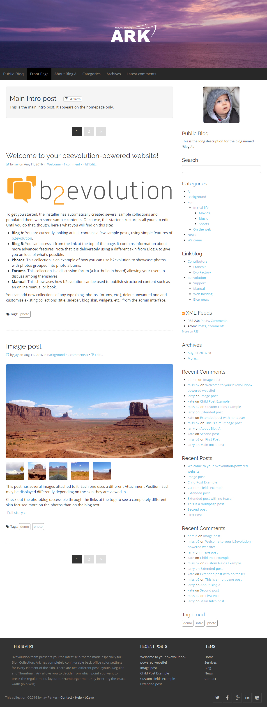
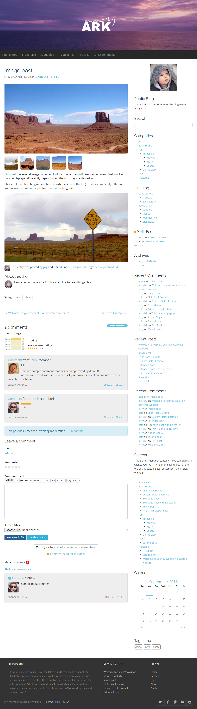

# Ark Skin for b2evolution CMS Blog v6
<a href="http://b2evolution.net/" title="www.b2evolution.net">B2evolution</a> team presents you the latest skin/theme made especially for <a href="http://b2evolution.net/man/about-different-collection-types" title="b2evolution Collections Explanation">Blog Collection</a>.  
 
Link to skin: <a href="http://skins.b2evolution.net/ark-skin" title="Ark skin">http://skins.b2evolution.net/ark-skin</a>. 
Developed by b2evo team. 
Current (stable) version: 1.0.0

---

### Main skin features:

- Chose from one of the three sidebar layouts: left sidebar, right sidebar or no sidebar;

- Ark has completely configurable back-office color settings for every element of the skin;

- Responsive menu at it's finest! Ark allows you to decide from which point you want to break the regular menu layout to "Hamburger menu" by inserting the exact width (in pixels)

---

#### Posts display

#### Single post display

### Update Log

#### v1.3.0 
- pagination fix for disp=single (comments) and disp=search
- fixed disps access_denied and access_requires_login
- added disps help and msgform

#### v1.2.1
- HTML layout fixes
- Removed LESS modules for widgets
- Pagination layout fix
- Other visual fixes

### Update Log

#### v1.1.1
- Comment status badge position fix
- Pagination layout fix

#### v1.1.0-alpha
- Top menu content can now be positioned left of the viewport, in-line with the main content or in the center of the menu container
- Additional skin customization options
- Added new class <code>header_img</code> for image widget in header container. Adding this class to image widget makes header image responsive and scalable to the viewport
- Fixed hardcoded tags in disp=single
- Various visual improvements
