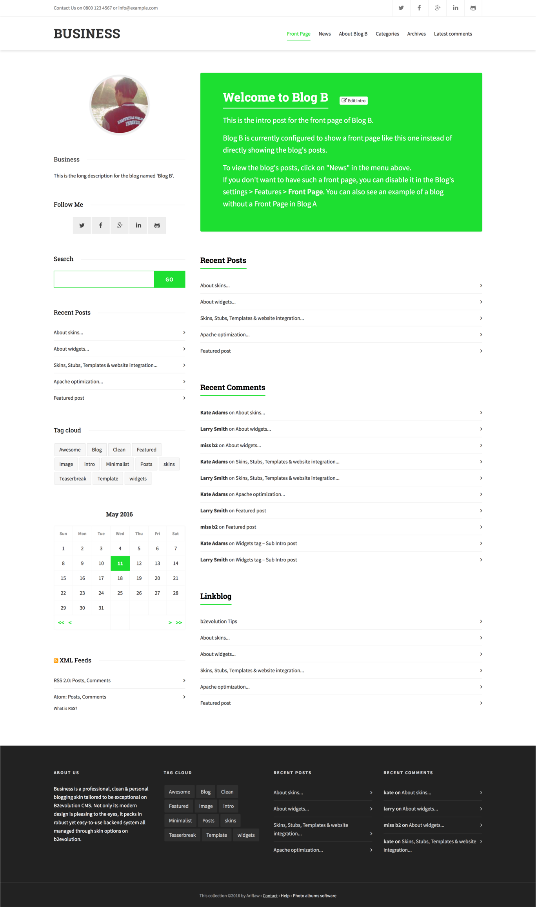
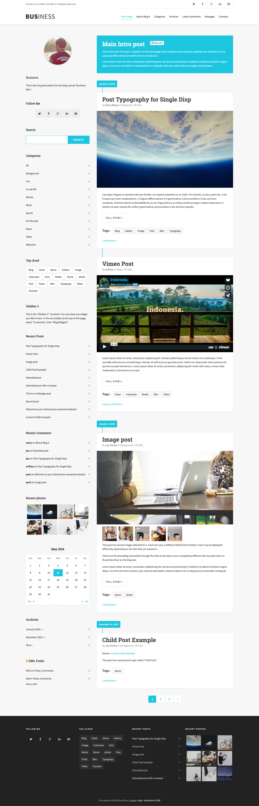
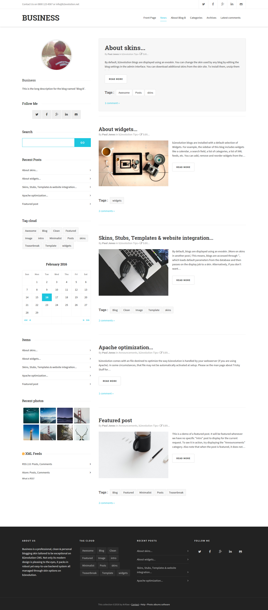
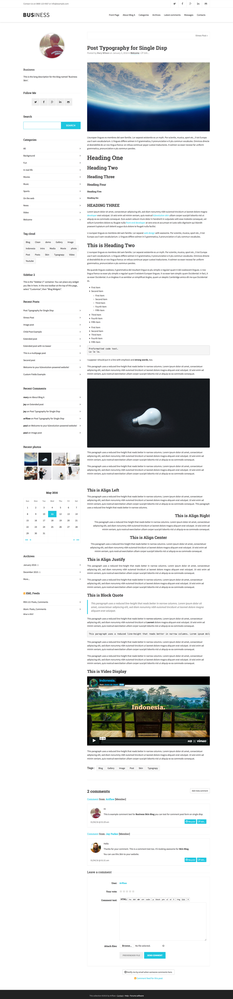
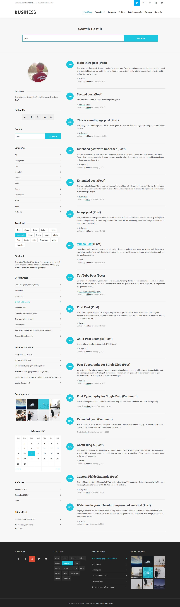

# Business Skin for b2evolution CMS v6

#### Business - Elegant and Clean Skin Blog

**Business** is a professional, clean & personal blogging skin tailored to be exceptional on b2evolution CMS. Not only is its modern design is pleasing to the eyes, but it packs a robust, yet easy-to-use back-end system, all managed through skin settings in b2evolution's back-office. Perfect choice for your personal, niche, corporate, marketing, authority or any type of creative blog / magazine.

It is highly customizable so it can match your personal taste. Enjoy plenty of awesome features, such as a variety of post layout options, numerous sidebar & footer widgets, and plenty of color, background and other skin customization options.

====

### Front Page

### Posts Page

### Posts Mini Blog

### Single Page

### Search Page

====

### Some of the Features:

- Fully Responsive Design
- Unlimited Color Schemes
- Unlimited Background Color
- Top Bar Header Elements
- Smooth Sticky Top Bar with Logo
- Responsive Mobile Menu
- Full Width Elements
- Unlimited Sidebars Layout
- Standard Blog Layout
- Mini Blog Layout
- Full Post, Sidebar, and Grid
- List Layout Full Width
- Blog Layout Full Width
- Blog Large Media
- Blog Small Media
- Photo Index Style Masonry
- One Column
- Right Sidebar
- Left Sidebar
- Footer Widget
- Social Icon
- Back to top button
- Crossbrowser Compatible
- Free Updates and new features.
- Long-term Support

====

### Need Assistance? Get In Touch!

If you ever get stuck with setting up Business with your b2evolution installation, please head over to the [Support Forum](http://forums.b2evolution.net/).

====

### Update Log:

## v1.3.1-stable
- Updated CSS and JS thumbprints for this skin's plugins and libraries
- Fix for floated images in content
- Improved default style for "About Author" widget
- Item Single widget enabled for additional back-office customization on disp=single
- Modified back-office customization titles for easier use
- Added translation notes for easier skin translation (multilanguage compatibility)

## v1.3.0-stable
- New fonts
- New cover image positions on posts
- Masonry layout improved/simplified - removed unnecessary sections
- Added four columns option for Masonry layout
- Fixed word wrapping on narrow sections
- More user-friendly background customizaiton options of the skin
- Additional small skin fixes

## v1.2.1-stable
- New Masonry layout on Posts page
- List layout fix for all list-type widgets

## v1.1.0-beta
- New layout system for widgets. Users can now apply different layouts for various widgets, with a small use of Bootstrap's grid system.
